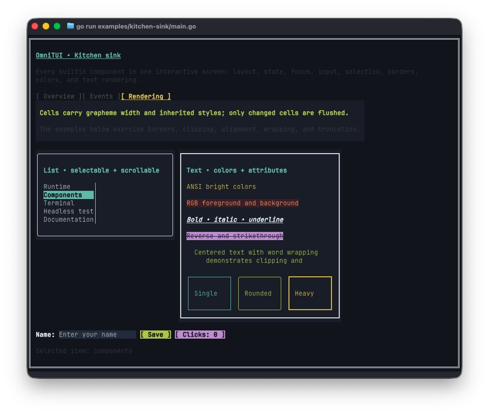
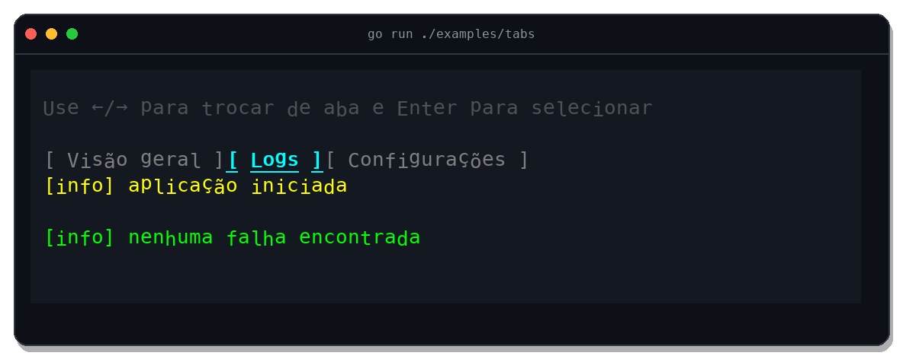
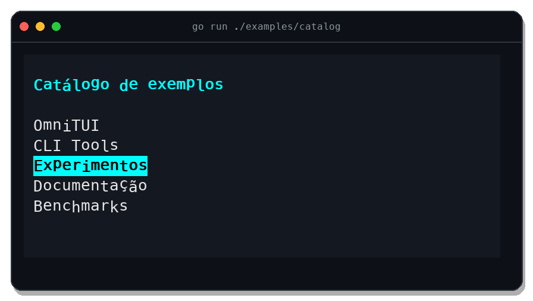

# OmniTUI

Declarative framework for building terminal interfaces in Go with components, state, and reconciliation inspired by the React mental model.

[](https://github.com/omnitui/omnitui/actions/workflows/release.yml)
[](https://go.dev/)
[](LICENSE)



OmniTUI turns the interface into a tree of immutable elements. The runtime preserves component state, computes layout, handles events, and sends only changed cells to the terminal.

> The project is at the MVP stage and supports ANSI/VT terminals on Linux, macOS, and Windows.

## Key features

- **Declarative components:** typed props, local state, context, keyed effects and refs, children, and composition.
- **Predictable reconciliation:** identity by type, position, and key, preserving state across compatible renders.
- **Ready-to-use builtins:** `Box`, `Row`, `Column`, `Text`, `Button`, `Input`, `Tabs`, and `List`.
- **Terminal layout:** horizontal or vertical direction, sizing, padding, gap, alignment, wrapping, clipping, and borders.
- **MVP interaction:** keyboard, text input, paste, focus, SGR mouse, wheel, resize, and external messages.
- **Inherited styles:** ANSI 16/256 colors, true color, foreground, background, and attributes such as bold, underline, and dim.
- **Unicode and incremental rendering:** visual grapheme width, double buffering, and cell diffs to reduce redraws.
- **Deterministic testing:** headless backend, integration tests, and a GitHub Actions workflow.

## Gallery

### Controlled tabs

Arrow keys move focus between headers; `Enter`, `Space`, or a click selects a tab. The active content remains controlled by application state.



### Selectable list

`List` provides controlled selection, keyboard navigation, automatic scrolling, wheel support, and styles for the active item.



## Installation

Requirements: Go 1.22 or later and an ANSI/VT100-compatible terminal. On Windows, use Windows Terminal or a modern Windows console host.

```bash
go get github.com/omnitui/omnitui/v2@latest
```

## Minimal example

The example below defines a component with local state and updates the interface when the button is pressed:

```go
package main

import (
	"context"
	"fmt"

	omnitui "github.com/omnitui/omnitui/v2"
	"github.com/omnitui/omnitui/v2/components"
)

type counterState struct {
	Value int
}

type counter struct{}

func (counter) InitialState(struct{}) counterState {
	return counterState{}
}

func (counter) Render(
	ctx omnitui.Context,
	_ struct{},
	state counterState,
	_ omnitui.Children,
) omnitui.Element {
	return components.Column(
		components.ColumnProps{Gap: 1, Padding: omnitui.All(1)},
		components.Text(components.TextProps{
			Content: fmt.Sprintf("Clicks: %d", state.Value),
		}),
		components.Button(components.ButtonProps{
			Label: "Increment",
			OnPress: func(omnitui.PressEvent) omnitui.EventResult {
				omnitui.UpdateState(ctx, func(current counterState) counterState {
					current.Value++
					return current
				})
				return omnitui.Consume
			},
		}),
	)
}

func main() {
	counterType := omnitui.Define("Counter", counter{})
	app := omnitui.New(
		omnitui.Create(counterType, struct{}{}),
		omnitui.Options{},
	)
	if err := app.Run(context.Background()); err != nil {
		panic(err)
	}
}
```

Save it as `main.go` and run:

```bash
go run .
```

## Included examples

| Example | Demonstrates | Run |
|---|---|---|
| [Styled components](examples/styled/main.go) | Colors, borders, focus, input, button, and tabs | `go run ./examples/styled` |
| [Tabs](examples/tabs/main.go) | Controlled selection and keyboard navigation | `go run ./examples/tabs` |
| [Catalog](examples/catalog/main.go) | Controlled list, selection, and scrolling | `go run ./examples/catalog` |
| [Form](examples/form/main.go) | Controlled input, focus, and submit | `go run ./examples/form` |
| [Counter](examples/counter/main.go) | Local state and button events | `go run ./examples/counter` |
| [Hooks](examples/hooks/main.go) | Context, effects, refs, viewport, and programmatic focus | `go run ./examples/hooks` |

Common controls:

- `Tab` and `Shift+Tab` move focus;
- arrow keys navigate `Tabs`, `List`, and `Input`;
- `Enter` or `Space` activate controls;
- mouse and wheel work in compatible components;
- `Ctrl+C` exits the application.

## Documentation

- [API reference](docs/API.md)
- [Component catalog and behavior](docs/COMPONENTS.md)
- [Architecture and design decisions](docs/DESIGN.md)
- [Code organization](docs/STRUCTURE.md)

## Development

```bash
go test ./...
go test -race ./...
go vet ./...
go build ./examples/...
```

The workflow at [.github/workflows/go-tests.yml](.github/workflows/go-tests.yml) runs the suite automatically on pushes and pull requests.

## License

Distributed under the MIT License. See [LICENSE](LICENSE).
